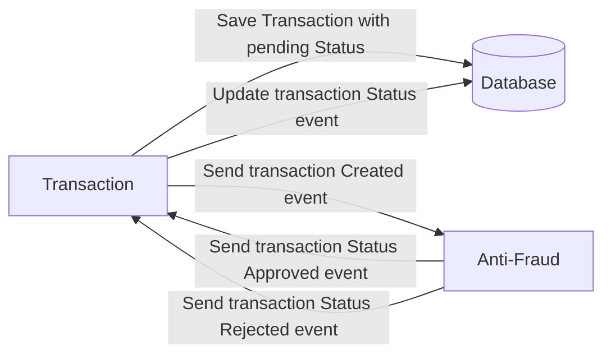

# Yape Code Challenge :rocket:

Our code challenge will let you marvel us with your Jedi coding skills :smile:. 

Don't forget that the proper way to submit your work is to fork the repo and create a PR :wink: ... have fun !!

- [Yape Code Challenge :rocket:](#yape-code-challenge-rocket)
- [Problem](#problem)
- [Tech Stack](#tech-stack)
  - [Optional](#optional)
- [Send us your challenge](#send-us-your-challenge)

# Problem

Every time a financial transaction is created it must be validated by our anti-fraud microservice and then the same service sends a message back to update the transaction status.
For now, we have only three transaction statuses:

<ol>
  <li>pending</li>
  <li>approved</li>
  <li>rejected</li>  
</ol>

Every transaction with a value greater than 1000 should be rejected.



# Tech Stack

<ol>
  <li>Java. You can use any framework you want</li>
  <li>Any database</li>
  <li>Kafka</li>
</ol>

We do provide a `Dockerfile` to help you get started with a dev environment.

You must have two resources:

1. Resource to create a transaction that must containt:

```json
{
  "accountExternalIdDebit": "Guid",
  "accountExternalIdCredit": "Guid",
  "tranferTypeId": 1,
  "value": 120
}
```

2. Resource to retrieve a transaction

```json
{
  "transactionExternalId": "Guid",
  "transactionType": {
    "name": ""
  },
  "transactionStatus": {
    "name": ""
  },
  "value": 120,
  "createdAt": "Date"
}
```

## Optional

You can use any approach to store transaction data but you should consider that we may deal with high volume scenarios where we have a huge amount of writes and reads for the same data at the same time. How would you tackle this requirement?

You can use Graphql;

# Send us your challenge

When you finish your challenge, after forking a repository, you **must** open a pull request to our repository. There are no limitations to the implementation, you can follow the programming paradigm, modularization, and style that you feel is the most appropriate solution.

If you have any questions, please let us know.

# Solucion del Challenge #

Ejecutar el comando
```bash
docker-compose up -d
```

Se ejecutara los contenedores necesarios para solucionar
el alcance basico que se solicito en el Challenge

> [!IMPORTANT]
> Al ser ejecutado el Docker-Compose, las APIs se exponen en el puerto "8092" y cuando se ejecuta de forma local se ejecuta en el puerto "8091".

API para generar una nueva transferencia.
```bash
curl --location 'http://localhost:8091/transactions' \
--header 'Content-Type: application/json' \
--data '{
    "accountExternalIdDebit": "550e8400-e29b-41d4-a716-446655447700",
    "accountExternalIdCredit": "550e8400-e29b-41d4-a716-446655447701",
    "transferTypeId": 1,
    "value": 9900.10
}'
```

La respuesta que nos devolvera es una similar a la siguiente
```bash
{
    "transactionExternalId": "ff2a75b5-9ba0-40a8-9329-e67a2ec19037",
    "transactionType": {
        "name": "1"
    },
    "transactionStatus": {
        "name": "pending"
    },
    "value": "9900.10",
    "createdAt": "2024-06-08T23:47:37.328-05:00"
}
```

API para consultar por un Id especifico
```bash
curl --location 'http://localhost:8091/transactions/4b2a815f-090b-4e4d-ba20-760cbad4c43d'
```
La respuesta sera una similar a la siguientes
```bash
{
    "id": "4b2a815f-090b-4e4d-ba20-760cbad4c43d",
    "accountExternalIdDebit": "550e8400-e29b-41d4-a716-446655447700",
    "accountExternalIdCredit": "550e8400-e29b-41d4-a716-446655447701",
    "transferTypeId": 1,
    "value": 99.10,
    "transactionStatus": "approved",
    "transactionType": "1",
    "createdAt": "2024-06-08T23:33:22.081-05:00"
}
```

API para consultar todas transferencias almacenadas
```bash
curl --location 'http://localhost:8092/transactions'

```

La respuesta sera una similar a la siguientes
```bash
[
    {
        "id": "2a6d9387-238a-4f07-9017-fd7506a6fd68",
        "accountExternalIdDebit": "550e8400-e29b-41d4-a716-446655447700",
        "accountExternalIdCredit": "550e8400-e29b-41d4-a716-446655447701",
        "transferTypeId": 1,
        "value": 99.10,
        "transactionStatus": "approved",
        "transactionType": "1",
        "createdAt": "2024-06-08T23:46:47.985-05:00"
    },
    {
        "id": "ff2a75b5-9ba0-40a8-9329-e67a2ec19037",
        "accountExternalIdDebit": "550e8400-e29b-41d4-a716-446655447700",
        "accountExternalIdCredit": "550e8400-e29b-41d4-a716-446655447701",
        "transferTypeId": 1,
        "value": 9900.10,
        "transactionStatus": "rejected",
        "transactionType": "1",
        "createdAt": "2024-06-08T23:47:37.328-05:00"
    }
]
```

El Flujo consiste en:

     1.- Se genera una nueva transferencia y se almacena como "pending" 
     para que pueda ser evaluada por el proceso de anti-fraude.
     2.- El segundo paso se ejecuta una suscripcion 
     al evento publicado en la "generación de transferencia" 
     y se ejecuta el proceso de anti-fraude.
     3.- Se cambia el estado en base al resultado del proceso
     ejecutado por el proceso de anti-fraude, el cual nos 
     indicara si la transferencia fue aceptada o rechazada.


Como parte de la solucion se tienen las siguientes consideraciones:

    1.- Se agrego pool de conexiones para la BD.
    2.- Se agrego TTL para los mensaje publicados.
    3.- Se agrego el manejo del logback.
    4.- Se agrego el manejo de perfiles para la creacion de imagenes con docker.
