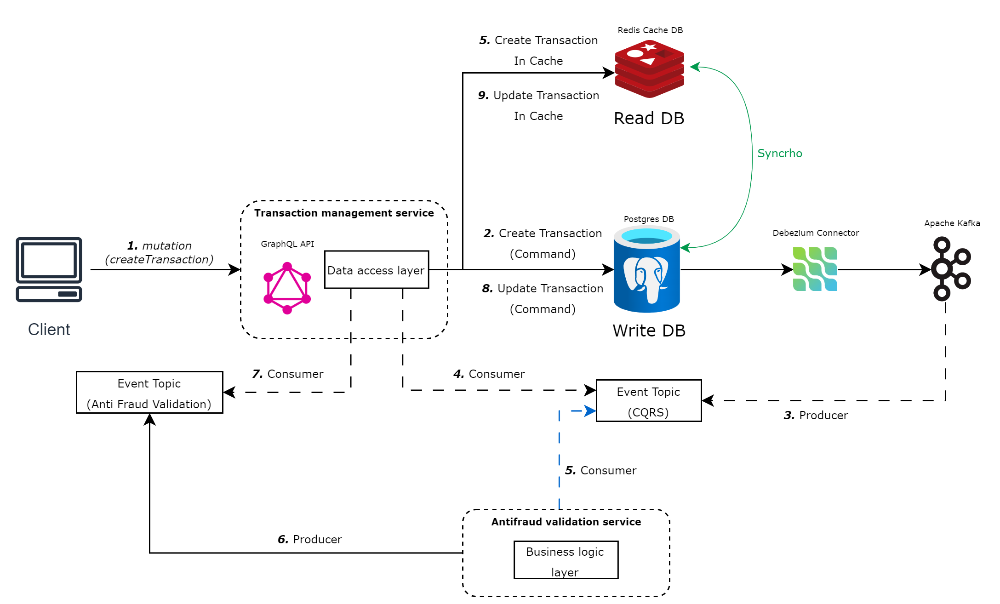

# Anti-Fraud Validation Service (AFVAL)

## Description

The Anti-Fraud Validation Service (AFVAL) is a microservice that evaluates the potential fraud level in newly created financial transactions. If the transaction amount exceeds 1000 (considered an anomalous case), the transaction is dismissed and automatically rejected.

## Tech Details
This project utilizes several technologies and design patterns to achieve its objectives:

- **EDA**: The service employs Event-Driven Architecture (EDA) to handle the transaction validation process. The service listens to events from the transaction management service and processes them accordingly.
- **Debezium**: Debezium, used with Kafka, captures when a transaction is created and propagates it to the anti-fraud validation service in real-time.
- **Kafka**: Kafka is used for event-driven architecture. The service produces events to notify the transaction management service about the transaction status.

## Requisites and Pre-configurations
Before running the Anti-Fraud Validation Service, you need to ensure that the necessary services and configurations are set up. If not, follow these steps:
1. **Start the Docker Services**: The application requires several services to run, which are defined in the `docker-compose.yml` file. To start these services, navigate to the directory containing the `docker-compose.yml` file and run the following command:
```bash
docker-compose up 
```
2. **Configure Debezium**: After starting the docker services, debezium must be configured, this configuration is done by requesting the debezium connector to the Kafka Connect API. To do this, you can use the following command:
```bash
./init-debezium.sh
```
3. **Start the Anti-Fraud Validation Service**: With the services running and Debezium configured, you can start the Anti-Fraud Validation Service in spring boot.
## Usage
The service does not provide a direct API for external access. It listens to events from the transaction management service and processes them accordingly, then it produces events to notify the transaction management service about the transaction status.

# Diagram


# Glossary
**AFVAL**: Anti Fraud Validation Service feature code
