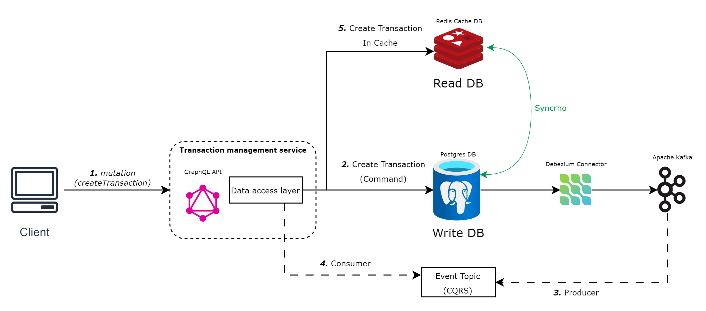
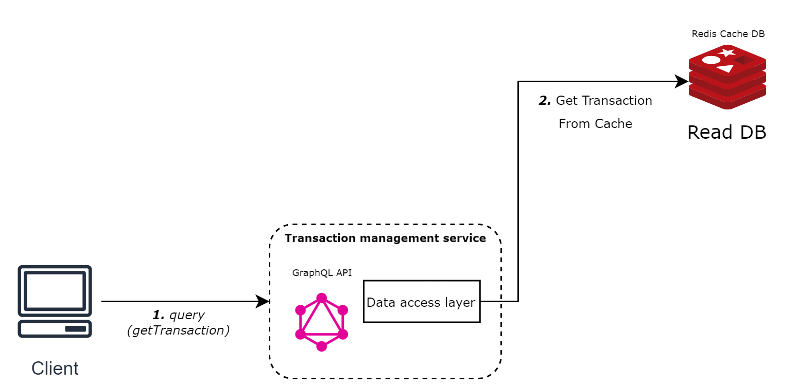
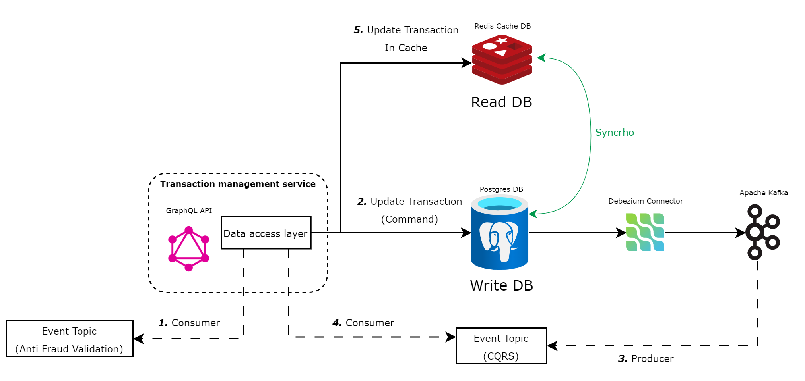

# Transaction Management Service (TXMNG)

## Description

The Transaction Management Service is a microservice that handles all operations related to financial transactions. It is responsible for creating, reading, and updating transactions, ensuring efficient and reliable transaction management.

## Tech Details

This project utilizes several technologies and design patterns to achieve its objectives:

- **CQRS**: The service employs Command Query Responsibility Segregation (CQRS) to separate read and write operations, allowing efficient handling of high volumes of simultaneous operations.

- **Hexagonal Architecture**: The service is designed using a hexagonal architecture, separating the core business logic from the external interfaces, making the system more flexible and easier to maintain.

- **Kafka**: Kafka is used for event-driven architecture. Each write operation on the database publishes an event to a topic, this event triggers the anti-fraud validation service.

- **Debezium**: Debezium, used with Kafka, captures database changes and propagates them to other services in real time, ensuring data consistency across the system.

- **Redis**: Redis serves as an in-memory database to store temporary data, enhancing application performance with fast data access and caching frequently accessed data, this cache DB is used to obtain details from a transaction.

- **GraphQL**: GraphQL provides a flexible and efficient interface for creating and retrieving transactions, allowing clients to specify exactly the data they need in a single request.

- **PostgreSQL**: PostgreSQL is the main database, storing all transactions. It ensures reliability and supports complex queries and transactions with ACID compliance.


## Requisites and Pre-configurations

Before running the Transaction Management Service, you need to set up the necessary services and configurations. Follow these steps:

1. **Start the Docker Services**: The application requires several services to run, which are defined in the `docker-compose.yml` file. To start these services, navigate to the directory containing the `docker-compose.yml` file and run the following command:
```bash
docker-compose up 
```
2. **Configure Debezium**: After starting the docker services, debezium must be configured, this configuration is done by requesting the debezium connector to the Kafka Connect API. To do this, you can use the following command:
```bash
./init-debezium.sh
```
3. **Start the Transaction Management Service**: With the services running and Debezium configured, you can start the Transaction Management Service in spring boot.
## Usage
The service provides a GraphQL API for creating and retrieving transactions. You can access the GraphQL playground at `http://localhost:8080/graphiql?path=/graphql`. The exposed API provides two main resources: one for creating a transaction and another for retrieving a transaction. Here's how to use them:
### Creating a Transaction
To create a transaction, you need to use the createTransaction mutation with the following arguments:

```graphql
mutation {
createTransaction(accountExternalIdDebit: "PE9521004163442100252363", accountExternalIdCredit: "PE9532004783456100178987", transferTypeId: 1, value: 120.0) {
    transactionExternalId
    accountExternalIdDebit
    accountExternalIdCredit
    transferTypeId
    value
    transactionType
    transactionStatus
    createdAt
    }
}
```
<sub>Consider that the `accountExternalIdDebit` and `accountExternalIdCredit` are the unique identifiers for the debit and credit accounts (**PE IBAN** Format) therefore cannot be the same, respectively. The `transferTypeId` is an identifier for the type of transfer, and the `value` is the amount of the transaction.</sub>

### Retrieving a Transaction

To retrieve a transaction, you need to use the `getTransaction` query with the `transactionExternalId` as an argument. 
```graphql
query {
  getTransaction(transactionExternalId: "TX13187f74-0305-4b03-91ba-f7be5a54e8") {
    transactionExternalId
    accountExternalIdDebit
    accountExternalIdCredit
    transferTypeId
    value
    transactionType
    transactionStatus
    createdAt
  }
}
```
<sub>The `transactionExternalId` is the unique identifier for the transaction you want to retrieve.</sub>

## Diagrams
### Create Transaction Flow


### Retrieve Transaction Flow


### Update Transaction Flow

## Glossary

**IBAN**: The International Bank Account Number consist of 24 alphanumeric characters, structured as follows:
- 2 digits for the country code (PE)
- 2 digits for the check digits
- 4 digits for the entity bank code
- 4 digits for the branch code
- 2 digits for the bank control digits
- 10 digits for the account number.

**TXMNG**: Transaction Management Service feature code